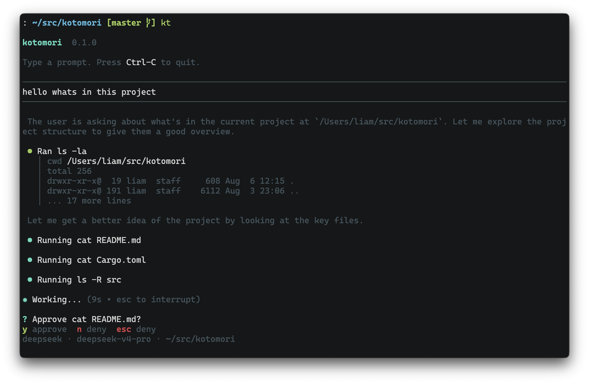

## kotomori

**kotomori** (言の森) is a coding agent in implemented in Rust, with a focus on
performance and simplicity.

## Prior Art

This project was inspired by tools like [pi](https://github.com/earendil-works/pi) and [opencode](https://github.com/anomalyco/opencode).
